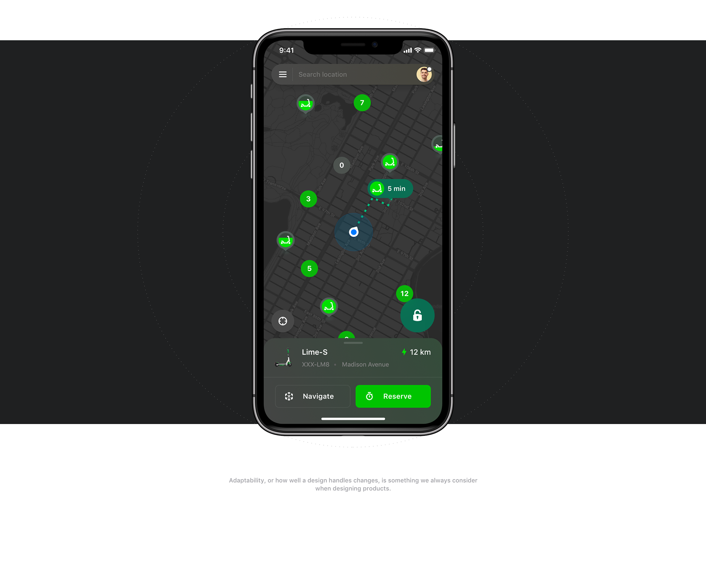

# LimeApp




LimeApp is a React Native application for an electric scooter service, inspired by the [Lime Electric Scooters Experience Reimagined](https://www.behance.net/gallery/97085269/Lime-Electric-Scooters-Experience-Reimagined) design on Behance.

## Table of Contents

- [Introduction](#introduction)
- [Features](#features)
- [Technologies Used](#technologies-used)
- [Installation](#installation)
- [Usage](#usage)
- [Credits](#credits)

## Introduction

LimeApp is designed to provide users with a seamless and intuitive interface for finding and using electric scooters. The app displays available scooters on a map, provides navigation to the nearest scooter, and allows users to unlock and ride the scooters.

## Features

- Display available scooters on a Mapbox map.
- Show user's current location.
- Provide navigation to the nearest scooter.
- Real-time updates of scooter availability.
- Beautiful UI inspired by the Lime Electric Scooters Experience Reimagined design.

## Technologies Used

- **React Native**: For building the mobile application.
- **Expo**: To streamline the development workflow.
- **Mapbox**: For map integration and displaying scooter locations.
- **TypeScript**: For type checking and improving code quality.
- **@gorhom/bottom-sheet**: For creating interactive bottom sheets.
- **@turf/distance**: For calculating distances between geographic coordinates.
- **expo-location**: For accessing the user's location.
- **Context API**: For state management.

## Installation

### Prerequisites

- [Node.js](https://nodejs.org/) installed on your machine.
- [Expo CLI](https://docs.expo.dev/get-started/installation/) installed globally.
- [Yarn](https://yarnpkg.com/) installed globally.
- [Mapbox Access Token](https://account.mapbox.com/).

### Steps

1. Clone the repository:

   ```sh
   git clone https://github.com/your-username/LimeApp.git
   cd LimeApp
   ```

2. Install dependencies:

   ```sh
   yarn install
   ```

3. Create a `.env` file in the root of your project and add your Mapbox access token:

   ```sh
   EXPO_PUBLIC_MAPBOX_KEY=your_mapbox_access_token
   ```

4. Start the development server:

   ```sh
   expo start
   ```

## Usage

### Running on Android Emulator

Ensure you have an Android emulator set up and running. Then, you can start the app on the emulator from the Expo Developer Tools.

### Running on Physical Device

To run the app on a physical device, download the Expo Go app from the [Google Play Store](https://play.google.com/store/apps/details?id=host.exp.exponent) or [Apple App Store](https://apps.apple.com/app/expo-go/id982107779). Scan the QR code provided by the Expo Developer Tools.

## Credits

- **Design Inspiration:** [Lime Electric Scooters Experience Reimagined](https://www.behance.net/gallery/97085269/Lime-Electric-Scooters-Experience-Reimagined) by [Steely Sampson](https://www.behance.net/steelysteele).
